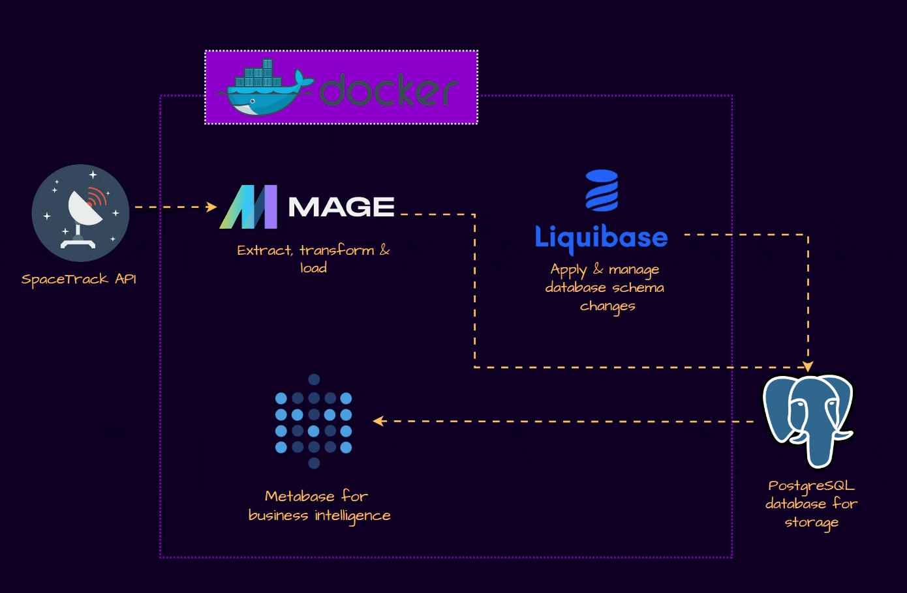

# What is it?

This demo pulls data from the SpaceTrack API, transforms it with Mage, and writes it to a DigitalOcean hosted PostgreSQL database.

* Extract: Data is extracted from the SpaceTrack API.
* Transform: MageAI, running inside a Docker container, processes and transforms the data.
* Load: The transformed data is loaded into a PostgreSQL database hosted on DigitalOcean.
* Manage & Analyse: Liquibase, within the same Docker container, manages database schema changes, ensuring the structure is always aligned with the data needs. Metabase, also in the Docker container, is used for querying, analyzing, and visualizing the data stored in PostgreSQL.

## Architecture 

This diagram encapsulates the flow of data through your ETL pipeline, highlighting the role of each component in processing and managing your data for insights.

 

 
